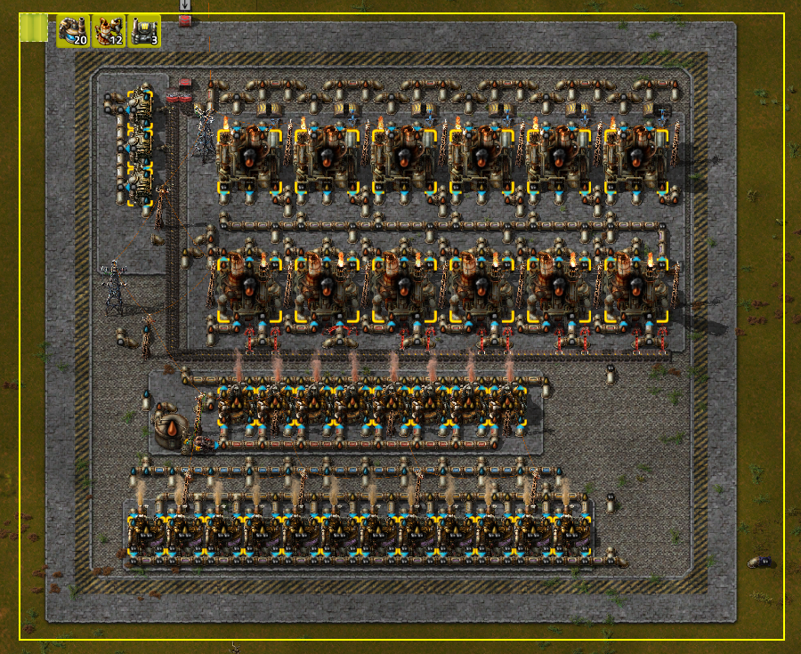
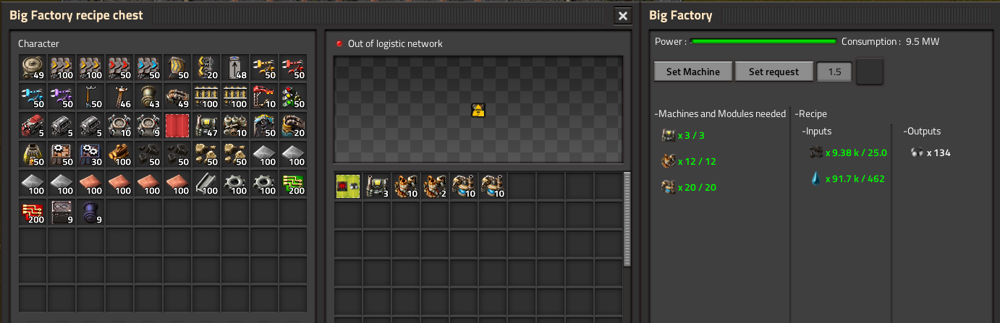

# Factor-y

Create a factory from RateCalculator. In purpose of saving FPS/UPS in GIGA Factory

## Installation

[Download on the Mod Portal.](https://mods.factorio.com/mod/Factor-y)

I recommand to install the optional librairy : [TagViewer](https://mods.factorio.com/mod/TagViewer)

## Usage

### Create recipe

1. Use RateCalculator Tool to calculate consumption and production of selection.
2. Then click the creation button on the top right corner of the gui. That add to your cursor the recipe.

### Know details about recipe

If the TagViewer mod is enabled, you can see the recipe with it.\
You can also duplicate the recipe item if you want.

### Big Factory : Definition

Big Factory is a "multiblock" entity.\
The blue chest is the input entity. It's work as logistic chest requester.\
The red chest is the ouput entity. It's work as logistic chest passive provider.\
There are also inputs/outputs tank.\
In the Recipe chest(green part), you must put **only one** recipe ,and all the machines and modules needed.

### Big Factory : Use

Each second, if the Big Factory have enough power and all machines/modules needed it try to remove items and fluids from inputs chest/tanks according to the recipe, and put the output in the ouput chest/tanks.\
If there is something wrong with the multiblock, the errors panel tells you what is wrong.

 :warning: $${\color{red}BE \space CAREFUL \space IF \space THERE \space ARE \space NO \space SPACE \space IN \space THE \space OUTPUT \space CHEST\/TANKS, \space INPUTS \space ITEMS\/FLUIS \space WILL \space BE \space LOST \space !!}$$

Example :\
      In the picture you can see power is missing, and inputs items.
